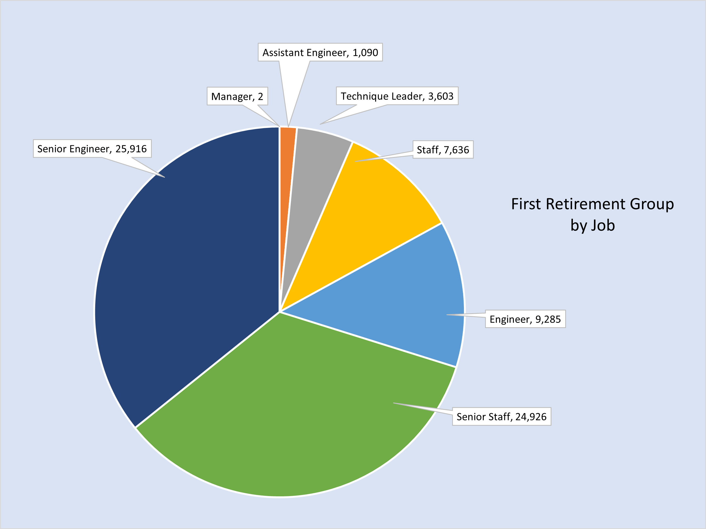
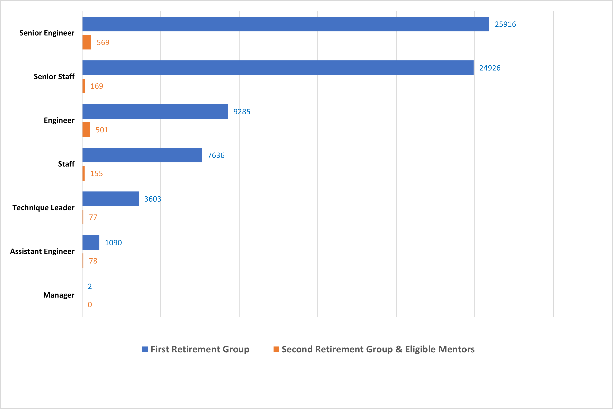

# Pewlett-Hackard-Analysis

***Overview of the analysis:***

In preparation for attrition due to retirement, identify total number of employees who will be eligible for retirement, allowing the organization to plan for available positions and to allow the organization to allocate additional resources

***Results:***

•	Identified retirement-ready group of employees born between 1952-1955 capturing all job positions held during their employment history with the company.

•	Identified retirement-ready group of current employees born between 1952-1955 capturing their most recent position with the company.  This data provides a snapshot of how many employees will be retiring including a tally of how positions may need to be filled.

•	Identified employees who were born in 1965, providing a count of employees ready for retirement after the first retirement population; Employees born 1952-1955.

•	Employees in their current position, born in 1965, identifies how many employees will be eligible to participate in the mentorship program.

***Summary:***

>Based on the provided data, it's estimated that approximately `72,458 employees will retire from the organization`. Out of these, 50,842 retiring employees hold >positions as Senior Engineers and Senior Staff, while the remaining 21,616 retiring employees hold a combination of positions such as Engineer, Assistant Engineer, >Technique Leader, Manager, and Staff.

>The organization may face a challenge in mentoring the next generation of employees due to a potential shortage of **retirement-eligible mentors**. Currently, **there >are only 1,549 employees** in the mentorship program, and it's possible that some may choose not to participate. Additionally, the possibility of early retirement may >further reduce the number of available mentors below the initial estimate of 1,549.

